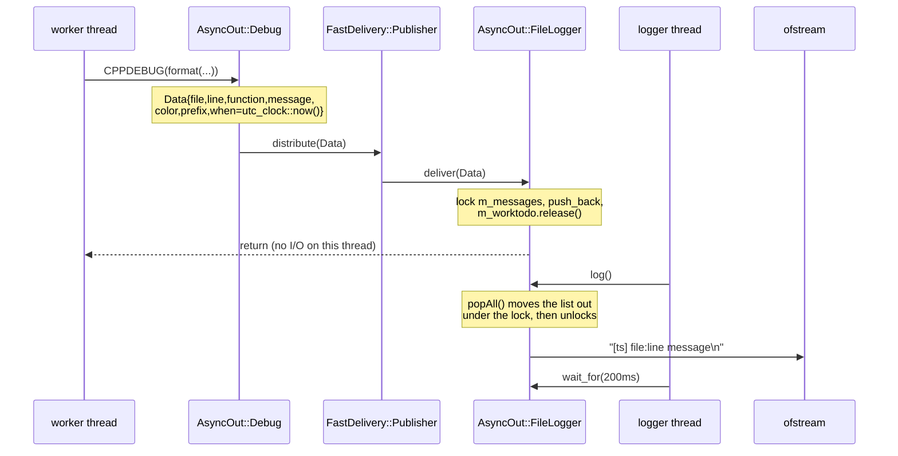

# Internals

Reference implementation: `examples/lotr_analyzer`. cpputils there is pinned at `3918380`; this
workspace has `4efaca0`. The difference matters in one place, marked below.

## Message path



The producer pays: one `Data` (two string allocations), one mutex, one `push_back`, one semaphore
release. It never blocks on the disk.

## Why it is built this way

**Timestamp at the call site.** `Data::when` is a default member initialiser, so it is evaluated
when `add()` constructs the struct — on the producer thread. The consumer's lag therefore does not
distort the times, and the log stays in production order even if the logger thread stalls.

**`popAll()` moves the list out.** The consumer swaps `messages` for a local list under the lock and
releases it before any formatting or file I/O:

```cpp
std::list<value_type> ret( std::move_iterator(std::begin(messages)),
                           std::move_iterator(std::end(messages)) );
messages.clear();
```

Without this, the producers would block for the whole duration of the write. With it, the lock is
held for a pointer swap.

**A binary semaphore instead of a condition variable.** `m_worktodo` is `std::binary_semaphore{0}`.
Each `deliver()` calls `release()`, and N releases collapse into one permit. The consumer does
`log(); wait_for(200ms);` — `wait_for` is `try_acquire_for`, so it drains everything that arrived
and then sleeps until the next message or 200 ms, whichever comes first. That is a natural
coalescing/batching loop without a second queue.

**`std::variant<std::string,std::wstring>` in `Data`.** A wide message stays wide across the
thread boundary and is converted by whichever backend knows the right encoding. That is what lets
the console use the locale path and the file use UTF-8 from the same queue.

**One frontend, many backends.** `AsyncOut::Debug` is a `FastDelivery::Publisher`, and each backend
is a `PublisherNode` registered by `subscribe()`. Console and file are independent: either can be
missing, and adding a third destination is one `subscribe()`.

## FastDelivery: fan-out, and its one surprise

`NodeListEntry` holds `std::atomic<bool> operation_in_progress` and `std::atomic<void*> node`.
`distribute()` walks the list and, per node:

```cpp
bool expected = false;
if( !nle.operation_in_progress.compare_exchange_weak( expected, true ) ) {
    continue; // someone else holds it — skip this node
}
```

So a node that is already being delivered to (or is being unsubscribed) **loses that message**.
The comment calls it "skip", and for `unsubscribe()` that is right. For two threads logging at the
same time it means data loss.

Measured with a standalone probe against this repo's `cpputils/cpputilsshared/FastDelivery.h`:
two producer threads, 200 `distribute()` calls each, a subscriber whose `deliver()` sleeps 200 µs —
`sent=400 received=200 dropped=200`. Exactly the half you get when one thread holds the flag and the
other skips.

In the real logger `deliver()` is only a mutex, a `push_back` and a `release`, so the window is
tiny and the loss rare — but it is not zero, and it grows with thread count and message rate. If
every line must survive, serialise the fan-out (a mutex around `distribute` in the frontend's
`add()`, or a plain mutex-protected queue instead of `FastDelivery`).

The older cpputils revision that the reference pins (`3918380`) did **not** skip — it spun until it
got the flag, and had no `unsubscribe()`. Upgrading cpputils therefore changes log-loss behaviour,
not just availability. Check which revision is on the include path before reasoning about it.

## Thread-safety summary

| Object | Guard | Notes |
|---|---|---|
| `Logger::messages` | `m_messages` | written by producers in `deliver()`, swapped out by the consumer in `popAll()` |
| `m_worktodo` | semaphore itself | binary; releases coalesce |
| `FileLogger::m_file` | `m_file_mutex` | taken by `log()` and by `flush()` — both from the same thread today, so the mutex is insurance against a future external caller or destructor |
| `Publisher::nodes` | `NodeListEntry::operation_in_progress` per node | `subscribe()`/`unsubscribe()` are not protected against each other by a lock; the CAS protocol covers delivery vs. unregistration |
| frontend `color` / `prefix` | none | read at call time in `add()`; `setColor()`/`setPrefix()` are not thread-safe against producers |

## Backend lifetime and shutdown

`subscribe()` stores a raw pointer to the node in the publisher's list. The node's destructor,
`~PublisherNode()`, spins until it can take the entry's flag, then clears `node` — so unregistering
is safe, but it only happens on destruction. Consequences:

- The final `log()` must run **while the backend is still alive**, i.e. inside the scope that owns
  it. Logging after the lambda returns is silently lost.
- `detach()` plus a detached thread that outlives `main()` is a crash waiting to happen. The
  reference avoids it with an RAII token: `App::WaitForObject` sets an `std::atomic<bool>` true on
  construction and false on destruction, `App::has_active_wait_for_objects()` lets the exit path
  poll it, and the thread's loop condition is `!APP.quit_request`. The process therefore waits for
  the last drain.

If the backend constructor throws (log file not writable), `subscribe()` has not run yet, nothing is
registered, and the exception handler prints to `std::cerr` — which is why the `catch` is *inside*
the lambda.

## Encoding

| Destination | Wide message becomes | Result |
|---|---|---|
| `std::cout` (`Logger::log`) | `DetectLocale::w2out( wstring )` | follows the console locale |
| file (`FileLogger::log`) | `Utf8Util::wStringToUtf8( wstring )` | always UTF-8 |

Same message, two conversions, on purpose. A UTF-8 log file stays readable and greppable regardless
of the machine's console codepage — which matters on Windows, where the console is often not UTF-8.

## What the reference does not have

Honest gaps, so nothing is assumed:

- **No severity levels** and no category/module filtering. `-debug` is a single on/off for the
  console backend; the file backend is driven by whether `LogFile` is configured.
- **No rotation, no size cap**, no `max_files`. Append-only, forever.
- **No `function` output**, although every call site captures `__PRETTY_FUNCTION__` into `Data`.
- The line **does** carry milliseconds: `%S` prints the fractional part when the time point
  is finer than seconds, so the timestamp is `[2026-09-24 15:00:18.491]` and its width is
  not constant. Verified against real output, not read off the format string.
- **No `prefix` in the file**, although `Data::prefix` carries it.

Adding a level is a two-line change in spirit: extend `Data`, and filter in `AsyncOut::Debug::add()`
before calling `distribute()` so suppressed messages never pay for the queue.
